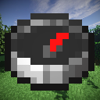

# CList
Coordinate List (CList for short) is a simple minimalistic fabric mod for saving your coordinates. No minimaps. Just a list with in-game waypoints.

  

---

(If you want to help and know any other language than English you can help by translating the mod [here](https://github.com/PouekDEV/CList) by making a pull request)

## Features
- Hotkey for placing a waypoint in the current position
- Automatic waypoints in the place where you died
- Copying the waypoint coordinates to the clipboard
- Toggling waypoint visibility
- Changing the size of the waypoint to your liking
- Changing the color of the waypoint to your liking
- Setting the maximum rendering distance for waypoints
- Detecting coordinates from chat
- Available in multiple languages
- **No minimap**

### The idea behind it
I initially created this mod just for me and my friends. I'm not too fond of these waypoint mods which always have built-in minimap which lagged my game even when it was off. So I made my own mod to fulfill the need for a lightweight, minimalistic waypoint mod.

### Support
CList will always receive latest features for the latest version of the game. Porting the newest features to older Minecraft versions is not planned so before creating an issue check if the feature you want isn't already implemented in the latest version of the mod.

Forge/NeoForge is not planned, but it seems that [Sinytra Connector](https://modrinth.com/mod/connector) does a pretty good job if you want to use CList on Forge/NeoForge.

You can freely include CList in any mod packs.